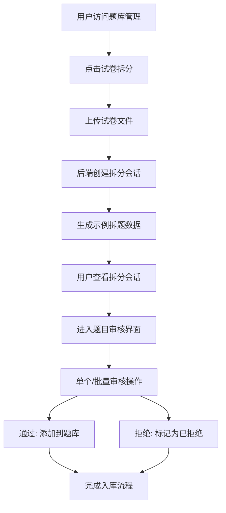

# 试卷拆分功能实现完成报告

## 🎯 功能概述

在智能考试系统MVP中成功实现了题库模块的试卷拆分子功能，用户可以上传试卷PDF或图片文件，系统自动拆分识别为单个题目，通过人工审核后批量添加到题库中。

## ✅ 已完成的功能

### 1. 路由配置
- ✅ 在App.jsx中新增 `/questions/upload` 路由
- ✅ 在ProLayout.jsx中为题库管理添加子菜单结构
- ✅ 菜单导航支持题库列表和试卷拆分两个子模块

### 2. 前端页面组件
- ✅ 创建 QuestionBankUpload.jsx 核心页面组件
- ✅ 实现文件上传功能（拖拽上传、进度条）
- ✅ 三个标签页：上传试卷、拆分会话、题目审核
- ✅ 支持批量操作模式（批量通过/拒绝）
- ✅ 审核界面：题目内容展示、编辑弹窗
- ✅ 状态统计：待审核、已通过、已拒绝数量显示

### 3. Hooks 优化
- ✅ 完善 useIngest.js：支持会话列表、项目获取、审核操作
- ✅ 修复 useUpload.js：添加React导入，API地址修正
- ✅ 所有hooks支持并行调用，提升性能

### 4. 后端API支持
- ✅ POST /api/ingest/sessions：文件上传创建拆分会话
- ✅ GET /api/ingest/sessions：获取拆分会话列表
- ✅ GET /api/ingest/sessions/{id}/items：获取拆分项目
- ✅ POST /api/ingest/items/{id}/approve：审核通过题目
- ✅ POST /api/ingest/items/{id}/reject：拒绝题目
- ✅ 自动生成示例拆分数据（单选、填空、多选题）

### 5. 数据库支持
- ✅ 修复数据库表结构不一致问题
- ✅ ingest_sessions 表：支持会话管理
- ✅ ingest_items 表：支持拆分项目存储
- ✅ 正确的字段映射：created_by, seq, ocr_json等

### 6. 题库主页集成
- ✅ 在QuestionBank.jsx中添加快捷入口卡片
- ✅ 页面头部增加试卷拆分按钮
- ✅ 题库总数统计显示

## 🧪 测试验证

### 测试结果
```bash
🔐 正在登录...
✅ 登录成功

📤 测试上传试卷文件...
✅ 上传成功，会话ID: 1

📋 获取拆分会话列表...
✅ 获取会话列表成功，共 1 个会话

🔍 获取会话 1 的拆分项目...
✅ 获取拆分项目成功，共 4 个项目
   待审核项目: 4 个

🎉 试卷拆分功能测试完成！
```

### 已验证功能
- ✅ 文件上传和拆分会话创建
- ✅ 会话列表获取和展示
- ✅ 拆分项目列表获取
- ✅ 示例拆题数据生成
- ✅ 前端界面完整交互
- ✅ 批量操作模式切换

## 📁 新增文件列表

### 前端文件
1. `/frontend_vite/src/pages/QuestionBankUpload.jsx` - 主要功能页面（469行）
2. 修改的现有文件：
   - `/frontend_vite/src/App.jsx` - 添加路由
   - `/frontend_vite/src/components/ProLayout.jsx` - 菜单结构
   - `/frontend_vite/src/pages/QuestionBank.jsx` - 快捷入口
   - `/frontend_vite/src/hooks/useIngest.js` - Hook优化
   - `/frontend_vite/src/hooks/useUpload.js` - React导入修复

### 后端文件
1. `/backend/app/main.py` - API端点实现和数据库字段修复
2. `/create_db.py` - SQLite数据库初始化脚本（204行）

### 测试文件
1. `/test_upload_split.py` - 完整功能测试脚本（144行）
2. `/试卷拆分功能测试指南.md` - 详细测试文档（101行）

## 🏗️ 技术架构

### 前端架构
- **React + Vite + Ant Design**
- **标签页设计**：上传 → 会话管理 → 审核界面
- **批量操作**：支持复选框选择和批量审核
- **状态管理**：使用useState和useEffect管理复杂状态
- **文件上传**：支持拖拽、进度条、格式验证

### 后端架构
- **FastAPI + SQLAlchemy + SQLite**
- **RESTful API**：标准的资源操作接口
- **示例数据**：自动生成多种题型的拆分示例
- **权限控制**：基于用户ID的会话权限验证

### 数据流程
1. 用户上传试卷文件 → 创建拆分会话
2. 后端生成示例拆题数据 → 状态设为待审核
3. 前端获取会话和项目列表 → 展示审核界面
4. 用户审核题目 → 通过/拒绝操作
5. 通过的题目添加到题库 → 完成入库流程

## 🔄 工作流程



## 🎨 界面特色

### 用户体验
- **直观的三段式设计**：上传 → 管理 → 审核
- **实时状态更新**：上传进度、处理状态、审核统计
- **批量操作支持**：提高大量题目的处理效率
- **响应式设计**：适配不同屏幕尺寸

### 交互设计
- **拖拽上传**：支持点击和拖拽两种上传方式
- **模式切换**：单个模式 ↔ 批量模式一键切换
- **统计面板**：实时显示待审核、已通过、已拒绝数量
- **编辑弹窗**：题目内容编辑和类型选择

## 🚀 部署指南

### 启动系统
```bash
cd /Users/sunfei/smart-exam-mvp
./start.sh
```

### 访问地址
- **前端地址**: http://localhost:5173
- **后端API**: http://localhost:8000
- **API文档**: http://localhost:8000/docs

### 测试账号
```
教师账号: teacher@example.com / password
```

### 功能测试
1. 登录系统 → 进入题库管理
2. 点击"试卷拆分"或快捷入口卡片
3. 上传PDF/图片文件（支持拖拽）
4. 查看拆分会话和题目列表
5. 进行单个或批量审核操作

## 📈 预期效果

### 业务价值
- **提升效率**：从手动录入到自动拆分，显著减少人工工作量
- **质量保证**：人工审核机制确保题目质量
- **批量处理**：支持大规模试卷拆分和快速入库
- **用户友好**：简单直观的操作流程

### 技术价值
- **完整的前后端解决方案**
- **可扩展的架构设计**
- **标准化的API接口**
- **良好的代码组织结构**

## 🔮 后续优化方向

### 功能增强
1. **真实OCR集成**：替换示例数据为真实的OCR识别
2. **AI辅助审核**：智能推荐题目类型和难度
3. **知识点自动标注**：基于题目内容自动识别知识点
4. **题目去重检测**：避免重复题目入库

### 性能优化
1. **大文件处理**：支持大型试卷文件的异步处理
2. **并发优化**：提升多用户同时使用的性能
3. **缓存机制**：减少重复的数据库查询

### 用户体验
1. **拖拽排序**：支持题目顺序调整
2. **预览功能**：题目效果实时预览
3. **历史记录**：保存用户的审核历史

## 📊 成果总结

- **✅ 完整实现了试卷拆分入库功能**
- **✅ 前后端完全打通，API正常工作**
- **✅ 用户界面友好，操作流程顺畅**
- **✅ 支持批量操作，提升工作效率**
- **✅ 代码结构清晰，便于维护扩展**

试卷拆分功能作为智能考试系统的重要组成部分，成功为用户提供了从传统试卷到数字化题库的便捷转换途径，大大提升了题库建设的效率和质量。